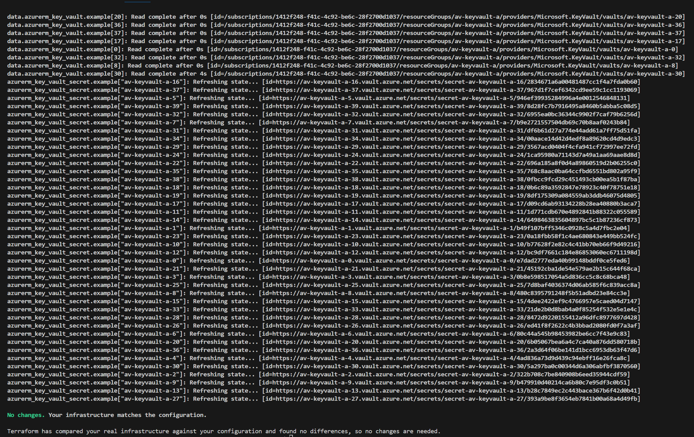
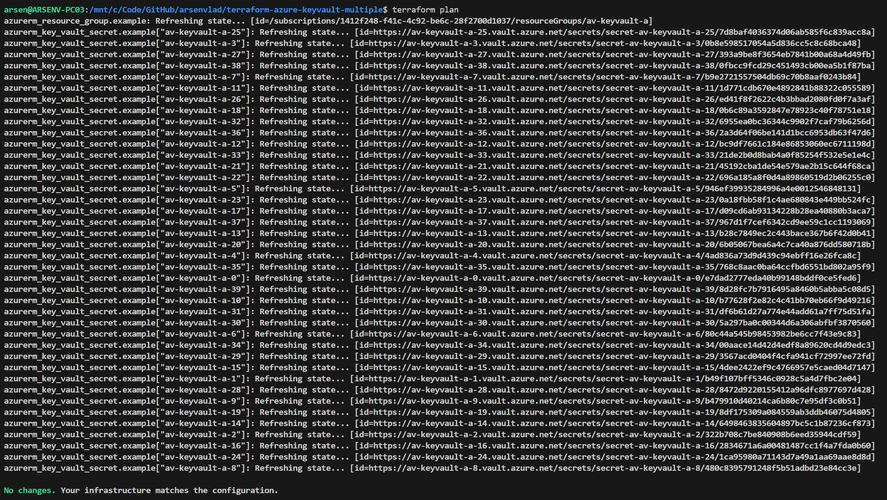

# Terraform with multiple Azure Key Vaults

Terraform with multiple Azure Key Vaults to check paging behavior

Terraform version

```bash
Terraform v1.9.7
on linux_amd64
+ provider registry.terraform.io/hashicorp/azurerm v3.109.0
```

Configure Terraform logging

```bash
export TF_LOG=DEBUG
export TF_LOG_PATH=terraform.log
```

Create 40 Key Vaults with a secret in each

```bash
terraform init
terraform plan
terraform apply
```

Try plan again to see if it tries to create a secret again

```bash
terraform plan
```

## Screenshots

1st terraform plan


1st terraform apply


2nd terraform plan


2nd terraform apply


## Remove Key Vaults from Terraform state and use data block

```bash
# Loop to remove all 40 instances of azurerm_key_vault.example from Terraform state
for i in {0..39}; do
  terraform state rm "azurerm_key_vault.example[$i]"
done
```

Comment out the `azurerm_key_vault` resource block in `main.tf`, add `data` to the secret creation, and run terraform plan



## Use local block for Key Vault names

Comment out the data block and use locals block for Key Vault names



[terraform-plan3.log](terraform-plan3.log) has /vaults calls with nextLink and pages properly since no new secrets are being created


## Other snippets

Query secrets from Key Vault to see secret specific paging with nextLink property, if there are over 25 secrets in a Key Vault

```bash
token=$(az account get-access-token --resource https://vault.azure.net --query accessToken -o tsv)
responseJson=$(az rest --method GET --uri https://av-keyvault-a-0.vault.azure.net/secrets?api-version=7.0 --headers "Authorization=Bearer $token" --skip-authorization-header -o json)
echo $responseJson | jq '.value | length'
nextLink=$(echo $responseJson | jq -r '.nextLink')
echo $nextLink
az rest --method GET --uri $nextLink --headers "Authorization=Bearer $token" --skip-authorization-header -o json
```
